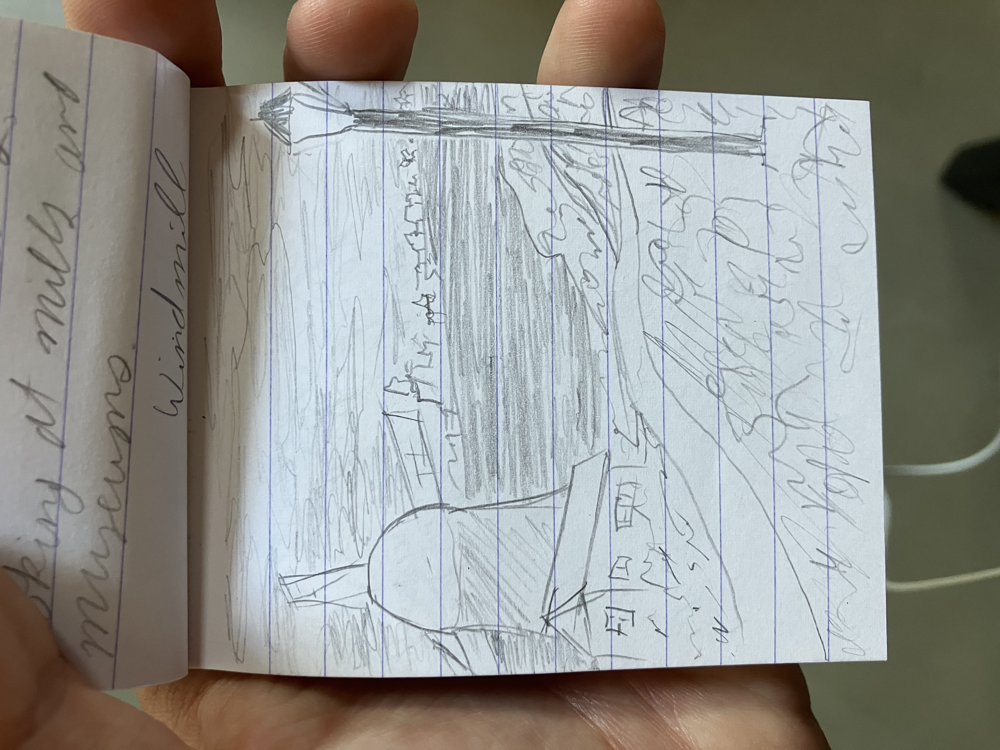
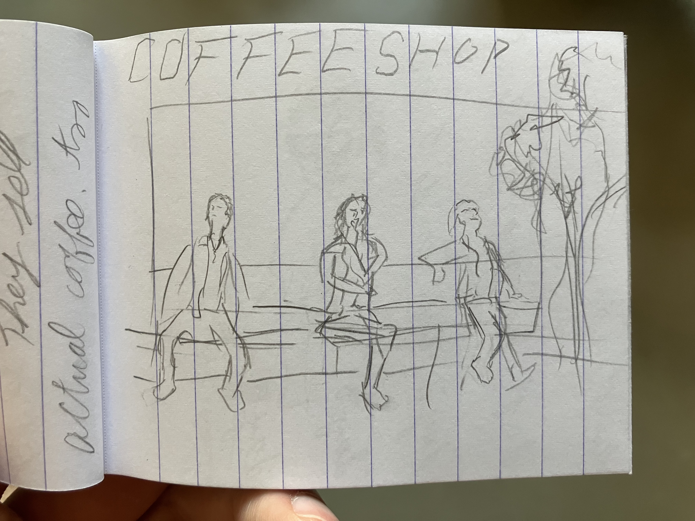
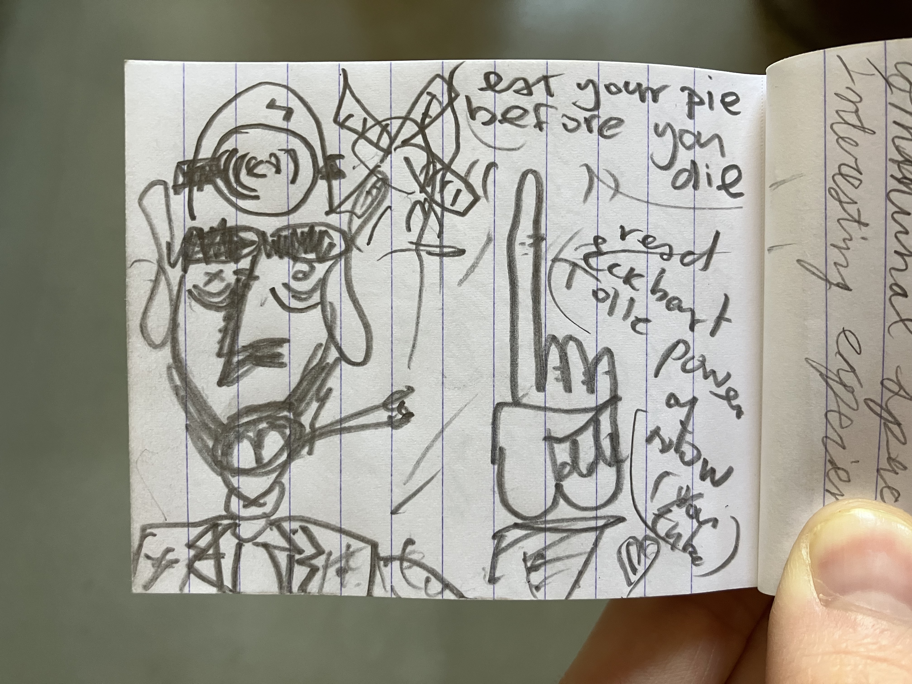
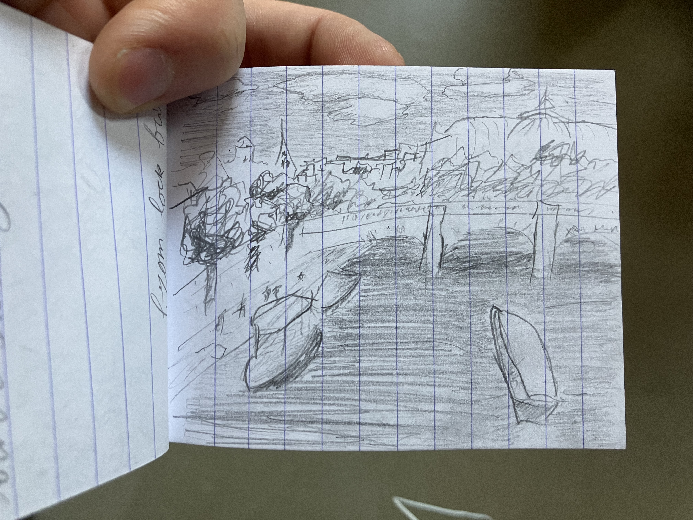
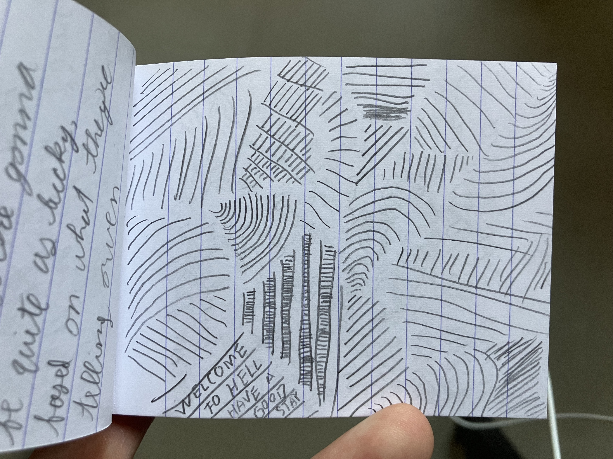

# To_Helen

### or How Many Media Can Will Fit in One Correspondence

```
I just know for a fact that if I tried to email you all of these 
pictures then Outlook would be upset with me. 25 MB limit, image 
quality reduction, so on and so forth. Anyways, I just wanted to 
show you a few things from that sketchbook I mentioned. 

```



```
This is from a town called Zaanse Schans, the heart of windmill
industry in old Holland. It's still a major producer of cocoa
products - the whole town smells like chocolate. They also make
paint (amsterdam acrylics!?), and I saw a pigment grinding mill

```



```
These places are all over Amsterdam. I don't know if you've 
been, but coffee is not the drug people are going in for. 
They do still sell coffee though. 

```



```
This is not my work, but was instead drawn by a strange guy who 
was running a bookstore out of his front room. He also offered
a beer to anyone who wanted to sit and paint outside. That was 
a great way to spend an afternoon. "Happy Bookieman" is what he
called himself. Might be a self portrait - the joint matches. 

```



```
The view from a bridge in Paris. This may have been the bridge
on which couples put padlocks, but they had to rebuild it for 
maintenance. The locks were not there anymore. Must be why 
divorce rates are up. 

```



```
Drawn from the floor of the Lisbon airport right after we found
out that our tickets home had been cancelled for an 
unsatisfying reason. I will never set foot in Lisbon again. 

```
